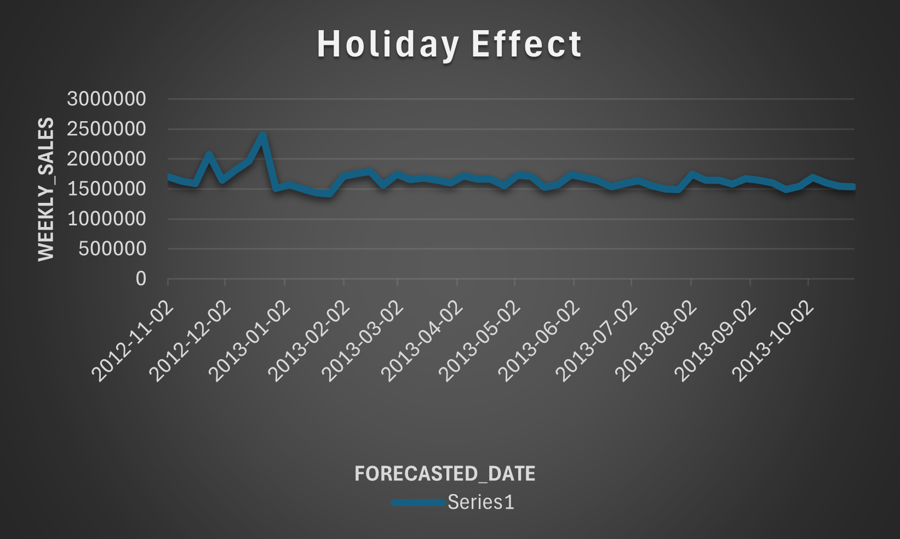
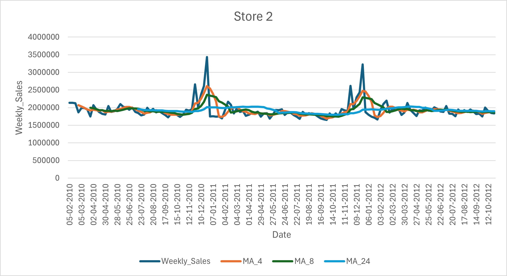

# walmart-sales-forecasting
Time series analysis and sales forecasting of Walmart store data using structured analytical methods.
The project includes demand trend analysis, holiday vs non-holiday comparisons, and store-level
moving average analysis to support inventory and staffing decisions.

## Project Overview
This project analyzes historical Walmart weekly sales (45 U.S. stores) together with economic indicators to:
1) Forecast average weekly sales for the next 12 months  
2) Compare holiday vs non-holiday weekly sales (Store 1)  
3) Compare sales trends between Store 1 and Store 2 using moving averages

The dataset includes weekly sales and contextual variables such as holiday weeks, temperature, fuel price, CPI, and unemployment.  
(Source: Kaggle Walmart dataset retail)  

## Business Questions
### Q1: What will the average weekly sales of all Walmart stores be for the next 12 months?
- A time series forecast was used to estimate future weekly sales patterns.
- Findings: sales remain relatively stable with repeating peaks during holiday periods and dips during non-holiday periods.

### Q2: At Walmart Store 1, how will holiday weeks affect weekly sales compared to non-holiday weeks in the next year?
- Findings: holiday weeks are predicted to produce higher weekly sales (~8%) compared to non-holiday weeks, based on consistent historical patterns.

### Q3: How do sales trends differ between Store 1 and Store 2, and how can this be used in future planning?
- Moving averages show Store 2 outperforms Store 1 across periods.
- Store 2 (24-week MA) shows declining weekly sales, while Store 1 is more stable.
- Both stores show seasonality and major spikes around late November/December.
- Store 1 appears more volatile, suggesting higher sensitivity to promotions/holidays/local demand.

## Data Cleaning Summary
- Verified and corrected data types (date formats; numeric formats and decimals)
- Checked missing values using filters
- Checked duplicates using remove duplicates
- Checked numeric columns for invalid negative values

## Recommendations
- Increase inventory and staffing before seasonal peaks (holiday periods)
- Reduce excess stock and adjust staffing during non-holiday periods to control costs
- Use Store 2 as a benchmark for store-level planning
- Apply stricter forecasting controls for Store 1 to reduce volatility and improve stock readiness

## Deliverables
- Forecast results (time series)
- Holiday vs non-holiday comparison (Store 1)
- Moving average comparisons (Store 1 vs Store 2)
- Data dictionary + ERD (as referenced in slides)

## References
- Patel, R. (2022). Walmart dataset retail [Data set]. Kaggle.
- ## Results (Visual Insights)

The analysis produced the following key visual outputs:

- Time series forecast of average weekly sales
- Comparison of holiday vs non-holiday weekly sales (Store 1)
- Moving average comparison between Store 1 and Store 2

Key patterns observed:
- Clear seasonal spikes during holiday periods
- Higher volatility in Store 1 compared to Store 2
- More stable long-term trend observed in Store 2
### Sales Forecast – All Stores

### Holiday vs Non-Holiday Sales (Store 1)

### Moving Average Comparison

